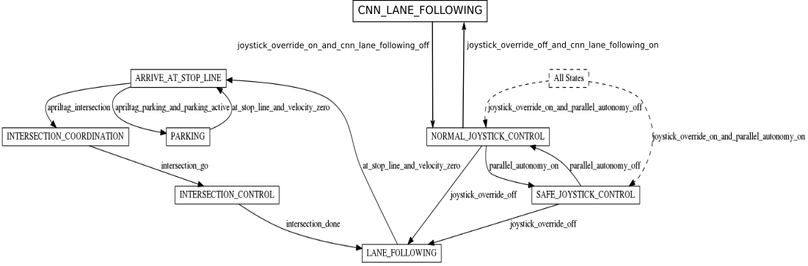

# Implementation

To run the machine learning based lane following three different docker images 
* `cnn_node`
* `dt-core`
* `dt-car-interface`

need to be built and run on the Duckiebot

## cnn_node
ROS package for machine learning based lane following on the Duckiebot. The node runs on the computer.

A node named cnn_node is initialized. The node subscribes to /camera_node/image/compressed. When the node receives a new image message the image is turned into grayscale and cropped. The cropped grayscale image is the input to the convolutional neural network (CNN). The ouput of the CNN is the relative pose, i.e., distance to middle lane and relative angle of the Duckiebot. The relative pose is used to computed the control signal (velocity and angular velocity) of the Duckiebot using a PID controller. Eventually, the control signal is published in the topic cnn_node/car_cmd. 

For further details see cnn_node.


## [dt-core](https://github.com/wickipedia/dt-core/tree/777fdb3bb02716de814f5845889d64853c7ec702)
`dt-core` is a fork of the official duckietown docker image [dt-core](https://github.com/duckietown/dt-core). We added a new state to the FSM called CNN_LANE_FOLLOWING. The state transition from NORMAL_JOYSTICK_CONTROL to CNN_LANE_FOLLOWING is toggeled if joystick_override_off_and_cnn_lane_following_on is true. The state transition from CNN_LANE_FOLLOWING to NORMAL_JOYSTICK_CONTROL is toggled if joystick_override_on_and_cnn_lane_following_of is true




## [dt-car-interface](https://github.com/wickipedia/dt-car-interface/tree/b6247cecb72d954adf902c095f7cd4147235754a)
`dt-car-interface` is a fork from the official duckietown docker image [dt-car-interface](https://github.com/duckietown/dt-car-interface). We added a new mapping `CNN_LANE_FOLLOWING: "cnn"` and a new source_topic `cnn: "cnn_node/car_cmd"` to the `car_cmd_switch_node`


# Usage
Before the cnn_node can be executed make sure the custom docker images dt-core and dt-car-interface, and the default docker image dt-duckiebot-interface run on the duckiebot. The docker image can be found in this directory - dt-core, dt-car-interface. To build dt-core and dt-car-interface clone the respective repository and change into the directory containing the docker images dt-core and dt-car-interface and build it with:

```
dts devel build -f --arch arm32v7 -H VEHICLE_NAME.local
```
Before you run the custom docker container dt-core and dt-car-interface make sure no other dt-core and dt-car-interface run on the Duckiebot.

To run the docker images execute
```
docker -H VEHICLE_NAME.local run --name dt-core-cnn -v /data:/data --privileged --network=host -dit --restart unless-stopped duckietown/dt-core:daffy-arm32v7
```
```
docker -H VEHICLE_NAME.local run --name dt-car-interface-cnn -v /data:/data --privileged --network=host -dit --restart unless-stopped duckietown/dt-car-interface:daffy-arm32v7
```
Check if dt-duckiebot-interface runs on the Duckiebot. Otherwise run the docker container with:
```
docker -H VEHICLE_NAME.local run --name dt-car-interface-cnn -v /data:/data --privileged --network=host -dit --restart unless-stopped duckietown/dt-duckiebot-interface:daffy-arm32v7
```

After the successful initialization of dt-core, dt-car-interface and dt-duckiebot-interface you can build cnn_node. Run 
```
dts devel build -f --arch amd64
```
and after the build run the container with
```
docker run --net=host -e VEHICLE_NAME=VEHICLE_NAME -e ROS_MASTER_URI=http://ROS_MASTER_IP:11311/ -e ROS_IP=http://HOST_IP/ -it --rm duckietown/cnn_node:working-amd64
```
Replace VEHICLE_NAME with your Duckiebot name ROS_MASTER_IP with the IP address of your duckiebot and HOST_IP with the IP of your host computer.

When you successfully run cnn_node the message _Input your cmd ([a]: start cnn lane following. [s] stop cnn lane following)_ prompts on your screen. Then you can press _a_ to change the state to CNN_LANE_FOLLOWING and start the machine based lane following. Press _s_ to change the state back to NORMAL_JOYSTICK_CONTROL. 
